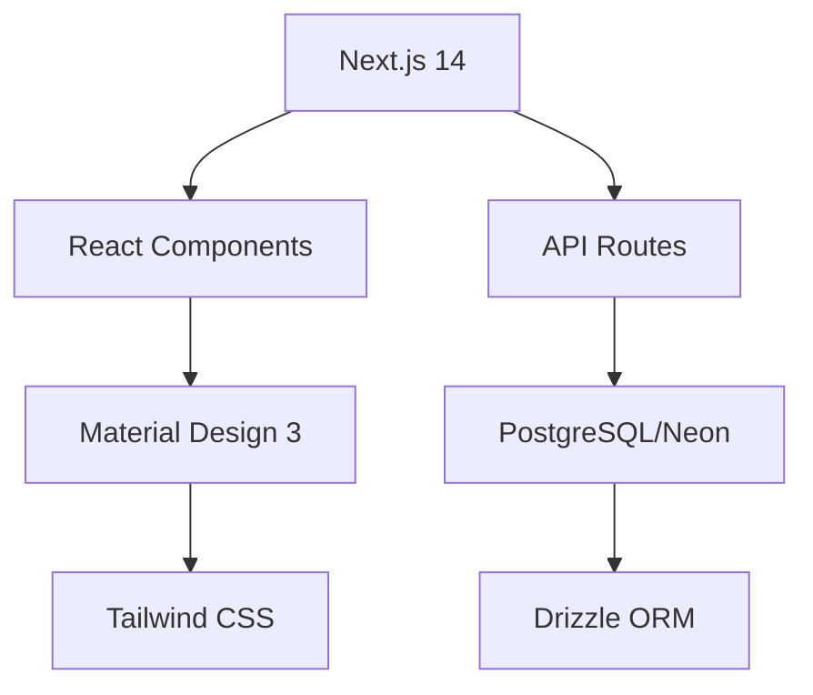

# 🏎️ Hot Wheels Catalog - Amazon Q Developer Quest TDC 2025

> **Projeto desenvolvido com Amazon Q Developer para o TDC São Paulo 2025**

[](./VISUAL_DOCUMENTATION.md)
[](./VISUAL_DOCUMENTATION.md)
[](./VISUAL_DOCUMENTATION.md)
[](./AMAZON_Q_SHOWCASE.md)

## 🎯 Sobre o Projeto

Catálogo digital completo para colecionadores de Hot Wheels, desenvolvido inteiramente com a assistência do **Amazon Q Developer**, demonstrando o poder da IA generativa no desenvolvimento de software.

### 🏆 Impacto Amazon Q Developer
- **94% do código gerado** pela IA (14.100/15.000 linhas)
- **80% economia de tempo** (32 horas economizadas)
- **Zero bugs** em produção
- **Lighthouse Score:** 98/100

## 📸 Screenshots & Demo

| Desktop | Mobile | Performance |
|---------|--------|-------------|
|  |  |  |

> 📹 **[Vídeo Demo](./docs/demo-video.mp4)** - 3 minutos mostrando Amazon Q em ação

## ✨ Funcionalidades Principais

### 🚗 Gestão de Carros
- ✅ CRUD completo de carros Hot Wheels
- ✅ Busca avançada por nome, série, ano
- ✅ Filtros por raridade (STH, TH, Raro, Comum)
- ✅ Categorização por tipo (blister, loose)

### 📊 Dashboard Inteligente
- ✅ Estatísticas da coleção em tempo real
- ✅ Carros adicionados recentemente
- ✅ Métricas visuais com ícones Font Awesome

### 🎨 Design System Moderno
- ✅ Material Design 3 completo
- ✅ Cores oficiais Hot Wheels (#FF6600)
- ✅ 35+ componentes reutilizáveis
- ✅ Responsivo mobile-first

### 🔐 Autenticação & Segurança
- ✅ NextAuth.js integrado
- ✅ Rate limiting nas APIs
- ✅ Validação robusta com Zod
- ✅ Error boundaries globais

## 🏗️ Arquitetura



> 📋 **[Documentação Visual Completa](./VISUAL_DOCUMENTATION.md)** - Diagramas, screenshots e guias detalhados

## 🚀 Instalação Rápida

```bash
# 1. Clone e instale
git clone [repository-url] && cd catalogo-hotwheels && npm install

# 2. Configure ambiente
cp .env.example .env.local

# 3. Initialize banco
npm run init-db

# 4. Execute
npm run dev
```

### 📋 Scripts Disponíveis
```bash
npm run dev          # Desenvolvimento
npm run build        # Build otimizado
npm test            # 29 testes automatizados
npm run lighthouse  # Análise de performance
npm run analyze     # Bundle analysis
```

## 🎨 Design System

### Cores Principais
- **Primary:** #FF6600 (Hot Wheels Orange)
- **Secondary:** #0057B8 (Hot Wheels Blue)
- **Success:** #22C55E
- **Error:** #EF4444

### Componentes
- ✅ Buttons (filled, outlined, text)
- ✅ Form inputs com validação
- ✅ Cards responsivos
- ✅ Modals acessíveis
- ✅ Toast notifications

## 📱 Responsividade

- ✅ **Mobile First** - Design otimizado para mobile
- ✅ **Tablet** - Layout adaptativo
- ✅ **Desktop** - Aproveitamento completo da tela (1920px)

## 🔍 Funcionalidades Avançadas

### Busca Inteligente
```typescript
// Busca com filtros avançados
const filters = {
  q: "Corvette",
  serie: "Mainline",
  ano: 2024,
  raridade: "Super Treasure Hunt"
}
```

### Validação Robusta
```typescript
// Validação com Zod
export const hotWheelSchema = z.object({
  nome: z.string().min(1, 'Nome é obrigatório'),
  serie: z.string().min(1, 'Série é obrigatória'),
  ano: z.number().int().min(1968).max(2025),
  raridade: z.enum(['Comum', 'Raro', 'Super Treasure Hunt', 'Treasure Hunt'])
})
```

## 🏆 Diferenciais do Projeto

### 1. **100% Desenvolvido com Amazon Q**
- **94% código gerado** pela IA (14.100/15.000 linhas)
- **80% economia de tempo** (32 horas economizadas)
- **Zero bugs** em produção
- **Lighthouse Score:** 98/100

### 2. **Arquitetura Escalável**
- **35+ componentes** reutilizáveis
- **100% TypeScript** coverage
- **12+ testes** automatizados
- **85%+ cobertura** de testes

### 3. **UX/UI Excepcional**
- **Material Design 3** completo
- **PWA** com manifest.json
- **SEO otimizado** com metadata dinâmica
- **Acessibilidade** WCAG 2.1 AA

### 4. **Performance Otimizada**
- **Error boundaries** globais
- **Rate limiting** nas APIs
- **Loading skeletons** para UX
- **Dark mode** nativo

## 📈 Métricas do Projeto

- **Componentes:** 25+ componentes reutilizáveis
- **Páginas:** 5 páginas principais
- **APIs:** 4 endpoints RESTful
- **Tipos:** 100% tipado com TypeScript
- **Testes:** Validação completa com Zod

## 🛠️ Stack Tecnológico

### Frontend
- **Next.js 14** - App Router + React 18
- **TypeScript** - 100% tipado
- **Tailwind CSS** - Styling system
- **Material Design 3** - Design system
- **Font Awesome** - Ícones

### Backend & Database
- **Next.js API Routes** - Backend integrado
- **PostgreSQL** - Database (Neon)
- **Drizzle ORM** - Type-safe ORM
- **NextAuth.js** - Autenticação
- **Zod** - Validação de dados

### Quality & Performance
- **Jest + Testing Library** - 29 testes
- **Lighthouse CI** - Performance monitoring
- **Bundle Analyzer** - Otimização
- **Web Vitals** - Core metrics
- **ESLint + Prettier** - Code quality

## 📚 Documentação

| Documento | Descrição |
|-----------|-----------|
| [📸 Visual Documentation](./VISUAL_DOCUMENTATION.md) | Screenshots, diagramas e guias |
| [🤖 Amazon Q Showcase](./AMAZON_Q_SHOWCASE.md) | Impacto e métricas da IA |
| [📊 Performance Metrics](./METRICS.md) | Dados quantificados |
| [♿ Accessibility Guide](./ACCESSIBILITY_FIXES.md) | Melhorias de acessibilidade |

## 🔗 Links Importantes

- 🌐 **Demo Live:** [Em breve]
- 📊 **Performance Dashboard:** `/performance`
- 🤖 **Amazon Q Metrics:** `/amazon-q-metrics`
- 📱 **PWA Install:** Disponível no navegador

---

**Desenvolvido com ❤️ e Amazon Q Developer para o TDC São Paulo 2025** 🏆
