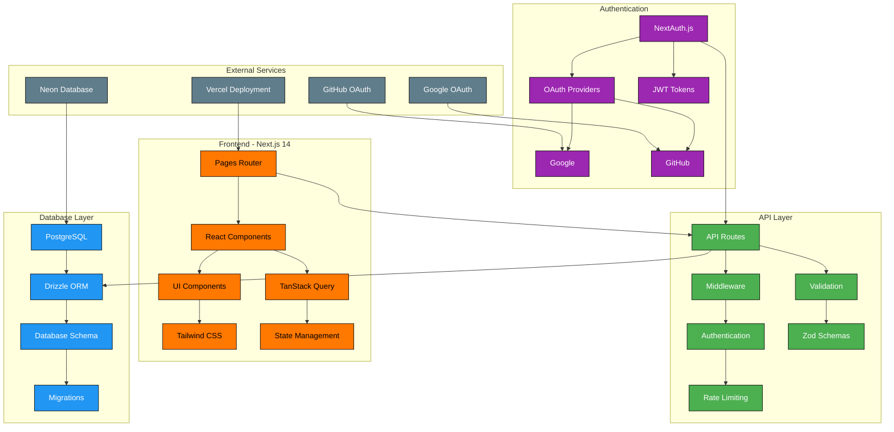
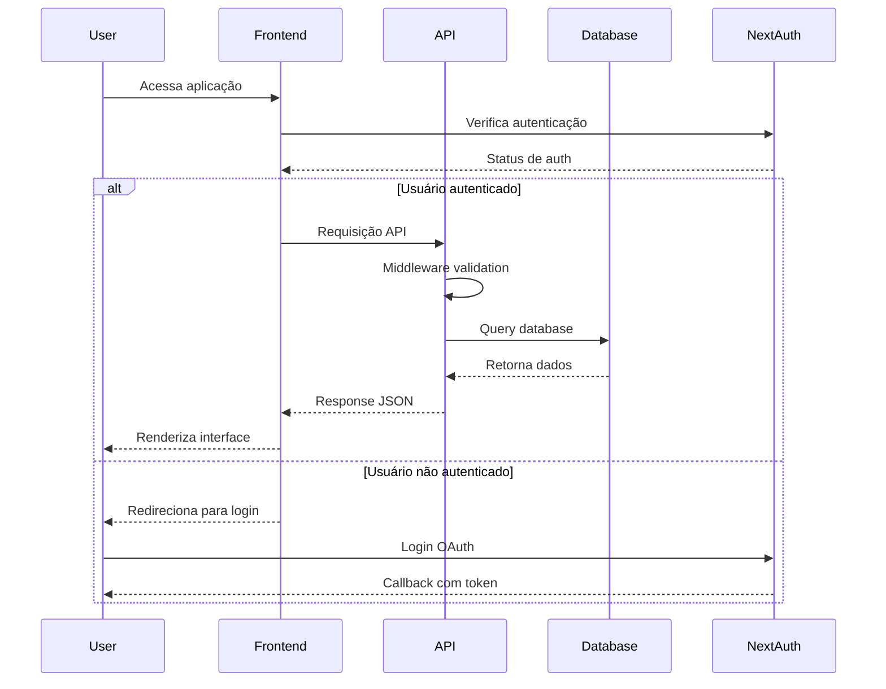
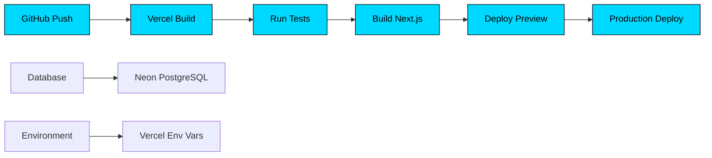

# 🏗️ Arquitetura do Sistema - Hot Wheels Catalog

## 📊 Diagrama de Arquitetura



## 🔧 Componentes Principais

### Frontend (Next.js 14)
- **Pages Router**: Roteamento baseado em arquivos
- **React Components**: Componentes funcionais com hooks
- **UI Components**: Sistema de design reutilizável
- **Tailwind CSS**: Estilização utilitária
- **TanStack Query**: Gerenciamento de estado servidor

### API Layer
- **API Routes**: Endpoints RESTful
- **Middleware**: Autenticação e rate limiting
- **Validation**: Validação com Zod schemas
- **Error Handling**: Tratamento centralizado de erros

### Database
- **PostgreSQL**: Banco de dados relacional
- **Drizzle ORM**: ORM type-safe
- **Migrations**: Controle de versão do schema
- **Connection Pooling**: Pool de conexões otimizado

### Authentication
- **NextAuth.js**: Sistema de autenticação
- **OAuth Providers**: Google e GitHub
- **JWT Tokens**: Tokens seguros
- **Session Management**: Gerenciamento de sessões

## 📁 Estrutura de Pastas

```
catalogo-hotwheels/
├── app/                    # App Router (Next.js 14)
│   ├── api/               # API Routes
│   ├── auth/              # Páginas de autenticação
│   ├── cars/              # Páginas de carros
│   ├── favorites/         # Páginas de favoritos
│   ├── lists/             # Páginas de listas
│   └── globals.css        # Estilos globais
├── components/            # Componentes React
│   ├── ui/               # Componentes UI reutilizáveis
│   └── ...               # Componentes específicos
├── lib/                  # Utilitários e configurações
│   ├── auth.ts           # Configuração NextAuth
│   ├── db.ts             # Configuração database
│   └── utils.ts          # Funções utilitárias
├── __tests__/            # Testes automatizados
├── docs/                 # Documentação
└── public/               # Assets estáticos
```

## 🔄 Fluxo de Dados



## 🛡️ Segurança

### Autenticação
- OAuth 2.0 com Google e GitHub
- JWT tokens seguros
- Session management
- CSRF protection

### API Security
- Rate limiting por IP
- Input validation com Zod
- SQL injection prevention
- Error sanitization

### Database Security
- Connection pooling
- Prepared statements
- Environment variables
- SSL connections

## 📈 Performance

### Frontend Optimizations
- Code splitting automático
- Lazy loading de componentes
- Image optimization
- Bundle analysis

### API Optimizations
- Response caching
- Database connection pooling
- Query optimization
- Compression

### Database Optimizations
- Indexed queries
- Connection pooling
- Query optimization
- Pagination

## 🧪 Estratégia de Testes

### Testes Unitários
- Componentes React
- Funções utilitárias
- Validação de schemas
- API endpoints

### Testes de Integração
- Fluxos completos
- Database operations
- Authentication flows
- API integration

### Testes E2E
- User journeys
- Critical paths
- Cross-browser testing
- Performance testing

## 🚀 Deploy e CI/CD



## 📊 Monitoramento

### Performance Monitoring
- Lighthouse CI
- Core Web Vitals
- Bundle size tracking
- API response times

### Error Tracking
- Error boundaries
- API error logging
- User feedback
- Performance metrics

### Analytics
- User behavior
- Feature usage
- Performance metrics
- Error rates
