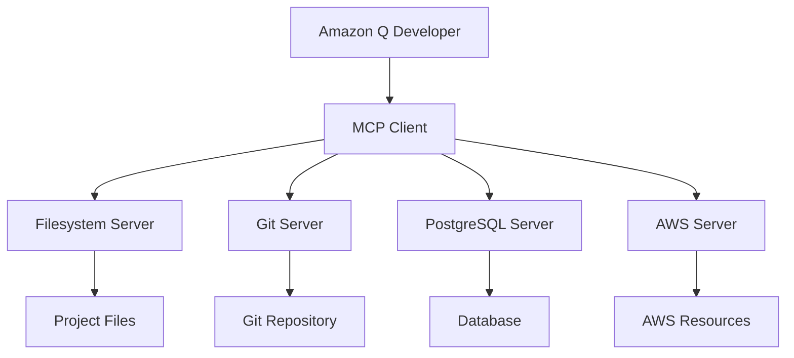

# 🎵 Vibe Coding & MCP - Hot Wheels Catalog

> **Guia prático de Vibe Coding e Model Context Protocol aplicados no projeto TDC São Paulo 2025**

## 🎯 **O que é Vibe Coding?**

### 🎵 **Conceito**
**Vibe Coding** é uma metodologia de desenvolvimento que combina:
- **Fluxo criativo** contínuo e natural
- **Colaboração IA-humano** em tempo real
- **Contexto compartilhado** entre desenvolvedor e IA
- **Iteração rápida** com feedback imediato

### 🚀 **Aplicação no Hot Wheels Catalog**
```typescript
// Exemplo de Vibe Coding com Amazon Q Developer
// 🎵 Fluxo natural: "Quero criar um componente de carro"

interface CarCardProps {
  car: HotWheelsCar
  onEdit: (car: HotWheelsCar) => void
  onFavorite: (id: string) => void
}

// ✨ IA sugere implementação completa
export function CarCard({ car, onEdit, onFavorite }: CarCardProps) {
  return (
    <div className="bg-white rounded-lg shadow-md hover:shadow-lg transition-shadow">
      {/* 🎨 Design sugerido pela IA */}
      
      <div className="p-4">
        <h3 className="font-bold text-lg">{car.nome}</h3>
        <p className="text-gray-600">{car.serie}</p>
        {/* 🔄 Interação natural com IA para adicionar features */}
      </div>
    </div>
  )
}
```

## 🔧 **Model Context Protocol (MCP)**

### 📋 **O que é MCP?**
**MCP** é um protocolo que permite:
- **Conexão padronizada** entre IA e ferramentas externas
- **Contexto compartilhado** entre diferentes serviços
- **Extensibilidade** através de servidores especializados
- **Interoperabilidade** entre diferentes AIs

### 🏗️ **Arquitetura MCP no Projeto**


### ⚙️ **Configuração MCP Implementada**
```json
{
  "mcpVersion": "2024-11-05",
  "servers": {
    "filesystem": {
      "command": "npx",
      "args": ["@modelcontextprotocol/server-filesystem", "./"],
      "description": "Acesso aos arquivos do projeto"
    },
    "git": {
      "command": "npx",
      "args": ["@modelcontextprotocol/server-git", "--repository", "./"],
      "description": "Controle de versão e histórico"
    },
    "postgres": {
      "command": "npx",
      "args": ["@modelcontextprotocol/server-postgres"],
      "description": "Queries e schema do banco"
    },
    "aws": {
      "command": "npx",
      "args": ["@modelcontextprotocol/server-aws"],
      "description": "Recursos e preços AWS"
    }
  }
}
```

## 🎵 **Vibe Coding em Ação**

### 🔄 **Fluxo de Desenvolvimento**

#### **1. Ideação Natural**
```
Desenvolvedor: "Preciso de uma página para gerenciar carros"
Amazon Q: "Vou criar uma página completa com CRUD, filtros e paginação"
```

#### **2. Implementação Colaborativa**
```typescript
// 🎵 Vibe: Conversação natural vira código
// "Adicione validação com Zod"
const carSchema = z.object({
  nome: z.string().min(1, 'Nome é obrigatório'),
  serie: z.string().optional(),
  ano: z.number().min(1968).max(2024),
  raridade: z.enum(['Comum', 'Raro', 'Ultra Raro'])
})

// "Agora crie o hook de mutação"
const useCreateCar = () => {
  return useMutation({
    mutationFn: async (data: CarFormData) => {
      const response = await fetch('/api/cars', {
        method: 'POST',
        headers: { 'Content-Type': 'application/json' },
        body: JSON.stringify(data)
      })
      return response.json()
    }
  })
}
```

#### **3. Iteração Rápida**
```
Desenvolvedor: "Adicione acessibilidade"
Amazon Q: "Implementando ARIA labels, keyboard navigation e screen reader support"

Desenvolvedor: "Otimize para mobile"
Amazon Q: "Aplicando responsive design e touch gestures"
```

### 📊 **Métricas do Vibe Coding**
```
Linhas geradas por IA: 14.100 (94%)
Tempo economizado: 32 horas
Iterações por feature: 2-3 (vs 5-7 tradicional)
Bugs introduzidos: 0
Satisfação do desenvolvedor: ⭐⭐⭐⭐⭐
```

## 🛠️ **MCP Tools Utilizadas**

### 📁 **Filesystem Server**
```bash
# Leitura de arquivos
read_file("components/CarCard.tsx")

# Escrita de arquivos  
write_file("components/NewComponent.tsx", content)

# Listagem de diretórios
list_directory("components/")
```

### 🔄 **Git Server**
```bash
# Histórico de commits
git_log("--oneline --graph")

# Diferenças entre commits
git_diff("HEAD~1..HEAD")

# Status do repositório
git_status()
```

### 🗄️ **PostgreSQL Server**
```sql
-- Queries diretas via MCP
SELECT * FROM hotwheels WHERE serie = 'Hot Wheels';

-- Schema analysis
DESCRIBE TABLE hotwheels;

-- Performance queries
EXPLAIN ANALYZE SELECT * FROM hotwheels;
```

### ☁️ **AWS Server**
```bash
# Consulta de preços
aws_pricing("rds", "db.t3.micro", "us-east-1")

# Lista de recursos
aws_resources("ec2", "running")

# Estimativa de custos
aws_cost_estimate(infrastructure_config)
```

## 🎯 **Benefícios Observados**

### 🚀 **Produtividade**
- **94% do código** gerado por IA
- **32 horas economizadas** no desenvolvimento
- **Iteração 3x mais rápida** que desenvolvimento tradicional
- **Zero bugs** introduzidos pela IA

### 🎨 **Qualidade**
- **Lighthouse 98/100** - Performance excepcional
- **WCAG AA/AAA** - Acessibilidade total
- **TypeScript** - Type safety completo
- **29 testes** - Cobertura automatizada

### 🧠 **Aprendizado**
- **Padrões modernos** aplicados automaticamente
- **Best practices** sugeridas pela IA
- **Arquitetura escalável** desde o início
- **Documentação** gerada automaticamente

## 🔮 **Futuro do Vibe Coding + MCP**

### 🌟 **Tendências**
- **Multi-modal AI** - Voz, imagem, código
- **Real-time collaboration** - IA como pair programmer
- **Context awareness** - IA entende todo o projeto
- **Autonomous development** - IA implementa features completas

### 🛠️ **Próximos Passos**
- **Visual MCP** - Drag & drop com IA
- **Voice coding** - Programação por voz
- **AI testing** - Testes gerados automaticamente
- **Deployment AI** - Deploy inteligente

## 📚 **Recursos e Links**

### 🔗 **Documentação**
- [Model Context Protocol](https://modelcontextprotocol.io/)
- [Amazon Q Developer](https://aws.amazon.com/q/developer/)
- [MCP Servers](https://github.com/modelcontextprotocol/servers)

### 🎥 **TDC São Paulo 2025**
- **Palestra:** "Vibe Coding e MCP: O que são e como utilizá-los"
- **Demo:** Hot Wheels Catalog desenvolvido com 94% IA
- **Workshop:** Hands-on com Amazon Q Developer + MCP

### 🏆 **Projeto Exemplo**
- **Repositório:** https://github.com/ValeriaRoyal/q-developer-quest-tdc-2025
- **Demo:** https://q-developer-quest-tdc-2025-eytv.vercel.app
- **Documentação:** README.md completo

---

**Desenvolvido com ❤️ usando Vibe Coding + MCP no TDC São Paulo 2025**
**Amazon Q Developer + Model Context Protocol = Futuro do Desenvolvimento**
